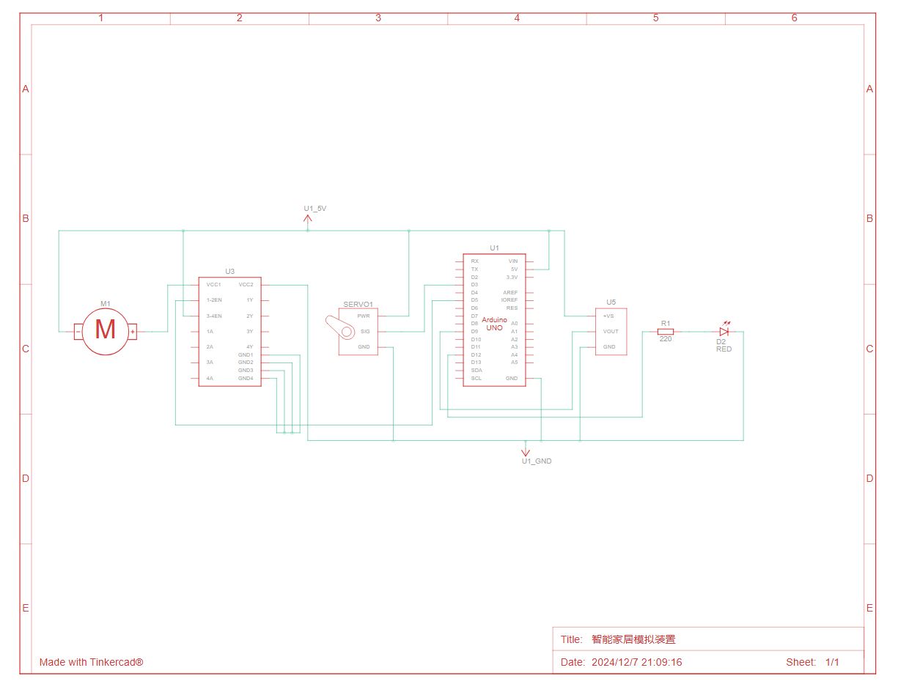
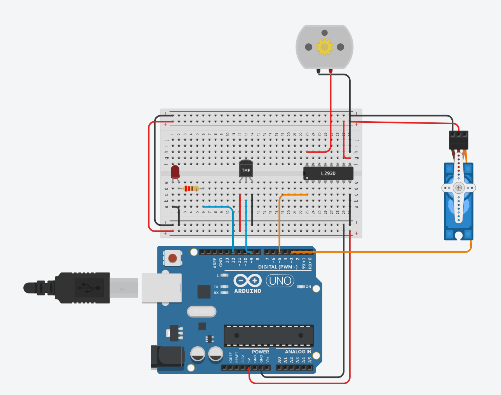
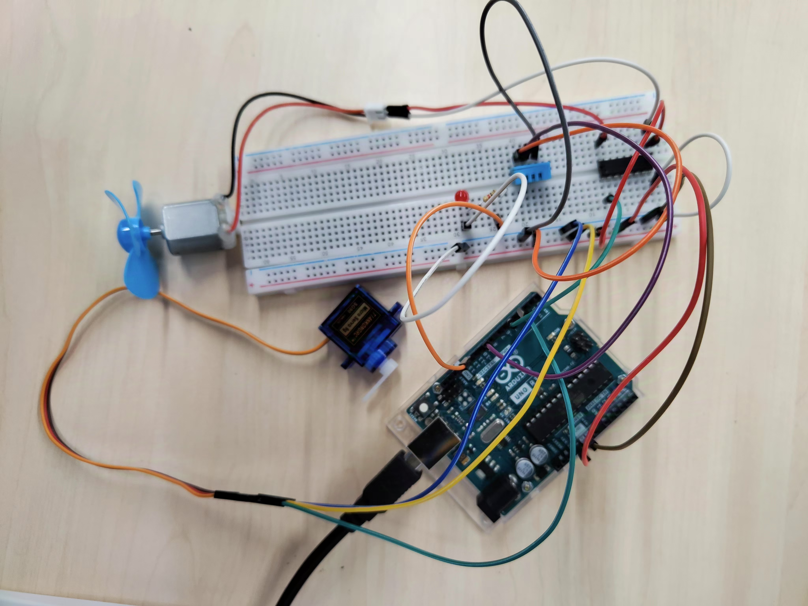
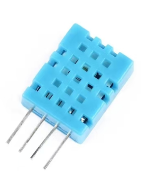
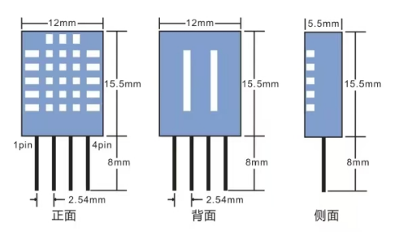
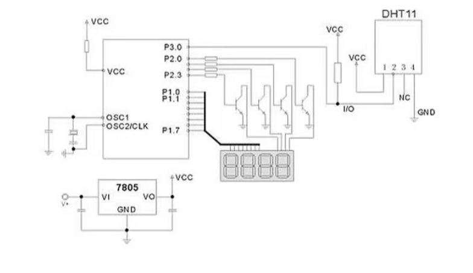

<h1 align="center">HAS: a simple home assistant system</h1>

> 本项目是作者在《交互技术》课程上的一个作业，作业的要求是设计并实现一个可以采集温湿度数据或用来开灯关灯的智能家居用户界面，我将其取名为汉斯（HAS），全程为a simple home assistant system。该项目主要使用Arduino单片机来模拟实际的智能家居控制，使用flask轻量级Web应用框架构建Web服务器（人生苦短，我用Python！），使用Figma原型设计软件设计前端界面，使用 HTML/CSS/JavaScript（”前端三件套“） + Bootstrap框架构建前端网页。因作者能力有限，部分工作通过ChatGPT协作完成，如您发现有任何错误或者优化的点，还请不吝赐教。

### 更新说明

### 1.项目文件说明

### 2.电路设计说明

电路部分初步打算使用Arduino单片机来模拟一个实际卧室的智能家居控制

- 使用二极管来模拟吸顶灯
- 用舵机来模拟电动窗帘
- 用温湿度传感器来模拟温湿度计
- 使用直流电机来模拟风扇
- 待补充......

#### 2.1电路设计图如下

#### 2.2模拟接线图

#### 2.3实物接线图参考

#### 2.4关于单片机选型

目前选择使用的是Arduino Uno3，选择它是因为Arduino有大量封装好的第三方函数库，上手起来比较容易。

未来会考虑替换为带蓝牙和WIFI的ESP32，从而实现数据的无线传输。

Arduino的入门教程可以参考[太极创客 – Arduino，人工智能，物联网的应用、开发和学习资料](http://www.taichi-maker.com/)

#### 2.5温湿度传感器的选型

温湿度传感器我选择的是DHT11传感器

型号:湿度传感器DHT11
工作电压:3-5.5V
温度测量范围:0°C~50°C
温度测量精度:士2°C
温度分辨率:1°C相对湿度测量范围:
20%~90% (0~50°C MAX)相对湿度测量精度:士5%相对湿度测量分辨率:1%RH

引脚定义:

- 1pin VDD:供电3-5.5VDC2pin DATA:串行数据，单总线
- 3pin NC:空脚，请悬空
- 4pin GND:接地，电源负极

尺寸图：

参考电路图：

### 3.软件架构说明

#### 3.1 固件代码

固件代码存放在 [control_and_recieve_data](Software/control_and_recieve_data)目录下，通过Arduino IDE烧录到Arduino Uno3上即可

### 4.Web设计说明