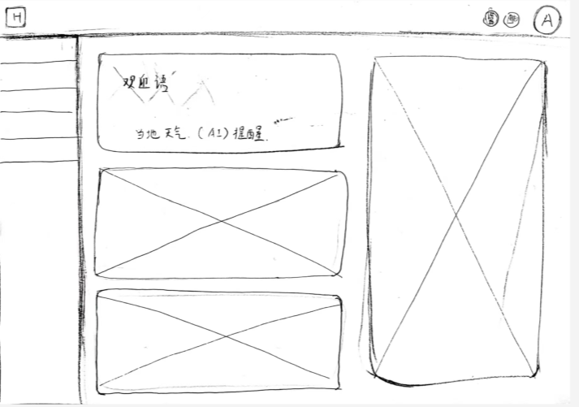
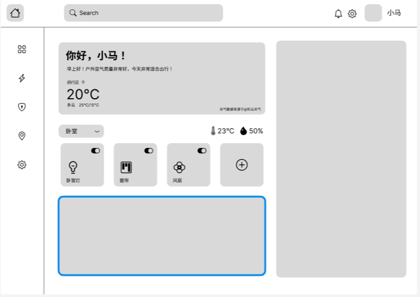
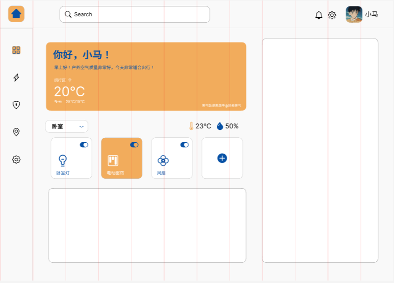
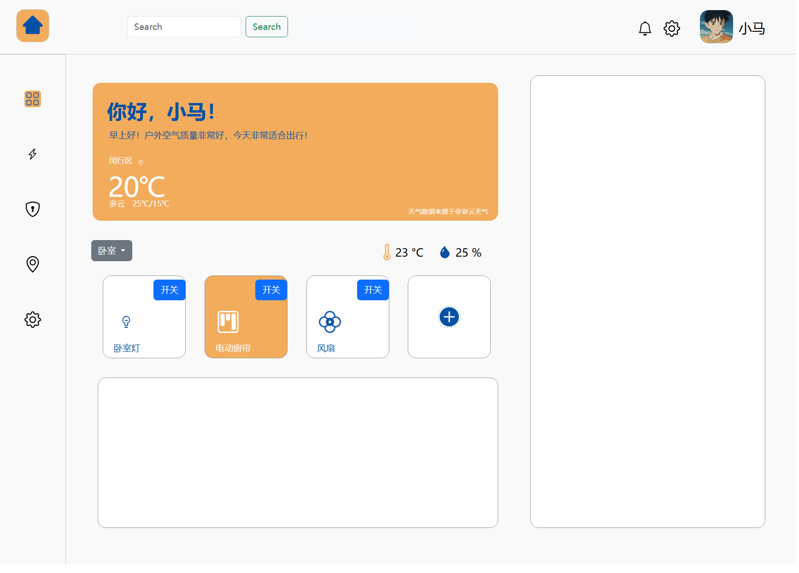

<h1 align="center">HAS: A Simple Home Assistant System</h1>
<div align="center">
<a href="https://github.com/ma-jiale/HAS/stargazers"></a>
<a href="https://github.com/ma-jiale/HAS/network/members"></a>
<a href="https://github.com/ma-jiale/HAS/pulls"></a>
<a href="https://github.com/ma-jiale/HAS/issues"></a>
<a href="https://github.com/ma-jiale/HAS/graphs/contributors"></a>
<a href="https://github.com/ma-jiale/HAS/blob/master/LICENSE"></a>

<a href="https://github.com/ma-jiale/HAS/blob/main/enREADME.md"></a>

<i>喜欢这个项目吗？请考虑给 Star ⭐️ 以帮助改进！</i>
</div>


> 本项目是作者在《交互技术》课程上的一个作业，作业的要求是设计并实现一个可以采集温湿度数据或用来开灯关灯的智能家居用户界面，我将其取名为汉斯（HAS），全称为A Simple Home Assistant System。该项目主要使用Arduino单片机来模拟实际的智能家居控制，使用flask轻量级Web应用框架构建Web服务器（人生苦短，我用Python！），使用Figma原型设计软件设计前端界面，使用 HTML/CSS/JavaScript（”前端三件套“） + Bootstrap框架构建前端网页。因作者能力有限，部分工作通过ChatGPT协作完成，如您发现有任何错误或者优化的点，还请不吝赐教。

### 更新说明

#### 24.12.7更新

- 新建仓库
- 添加README.md
- 添加电路设计
- 添加固件代码

#### 24.12.8

- 设计网页界面
- 建立前端代码文件结构
- 实现静态网页

#### 24.12.9

- 添加动态交互功能
- 修复无法链接图片的bug

### 1.项目文件说明

### 2.电路设计说明

电路部分初步打算使用Arduino单片机来模拟一个实际卧室的智能家居控制

- 使用二极管来模拟吸顶灯
- 用舵机来模拟电动窗帘
- 用温湿度传感器来模拟温湿度计
- 使用直流电机来模拟风扇
- 待补充......

#### 2.1电路设计图如下


#### 2.2模拟接线图


#### 2.3实物接线图参考


#### 2.4关于单片机选型

目前选择使用的是Arduino Uno3，选择它是因为Arduino有大量封装好的第三方函数库，上手起来比较容易。

未来会考虑替换为带蓝牙和WIFI的ESP32，从而实现数据的无线传输。

Arduino的入门教程可以参考[太极创客 – Arduino，人工智能，物联网的应用、开发和学习资料](http://www.taichi-maker.com/)

#### 2.5温湿度传感器的选型

温湿度传感器我选择的是DHT11传感器


型号:湿度传感器DHT11
工作电压:3-5.5V
温度测量范围:0°C~50°C
温度测量精度:士2°C
温度分辨率:1°C相对湿度测量范围:
20%~90% (0~50°C MAX)相对湿度测量精度:士5%相对湿度测量分辨率:1%RH

引脚定义:

- 1pin VDD:供电3-5.5VDC2pin DATA:串行数据，单总线
- 3pin NC:空脚，请悬空
- 4pin GND:接地，电源负极

尺寸图：


参考电路图：


### 3.软件架构说明

#### 3.1 固件代码

固件代码存放在 [control_and_recieve_data](Software/control_and_recieve_data)目录下，通过Arduino IDE烧录到Arduino Uno3上即可

#### 3.2 服务器后端代码

后端代码主要使用flask包和pyserial包，编写语言是Python, 存放在[HAS_gui.py](Software/HAS_gui.py)文件中。

Flask是一个轻量级的Web框架，用于构建Web应用程序。
下面是创建一个只有hello Web!的的网站简单程序示例：

```python
from flask import Flask

app = Flask(__name__)

@app.route("/")
def hello_world():
    return "<p>Hello, Web!</p>"

if __name__ == '__main__':
    # 启动Flask服务器
    app.run(host='0.0.0.0', port=5000)
```

`pySerial` 是一个用于在Python中与串口设备进行通信的库。它提供了简单的接口，用于通过串口（如RS232、USB转串口等）与外部设备（如传感器、微控制器、调制解调器等）进行数据交换。
下面是使用一个使用多线程技术读取串口数据的简单程序示例

```python
import serial
import threading
import time

# 设置串口参数
port = 'COM4'  # 根据你的实际情况设置端口号
baudrate = 9600  # 波特率与Arduino代码中的设置一致

# 打开串口
ser = serial.Serial(port, baudrate, timeout=1) # timeout参数用于设置串口读取操作的超时时间

def read_serial():
    time.sleep(2) # // 等待传感器数据稳定
    try:
        while True:
            line = ser.readline().decode('utf-8').strip()
            print("line:", line)
            time.sleep(2) 
    except KeyboardInterrupt:
        print("the program is closed")
    finally:
        ser.close()  # 关闭串口
    
if __name__ == '__main__':
    # 启动串口读取线程
    serial_thread = threading.Thread(target=read_serial)
    serial_thread.start()
```

服务器后端代码主要实现了从串口读取数据和发送数据，运行一个Web应用程序，并且响应用户的输入和显示串口读到的传感器信息。具体实现细节请看源代码[HAS_gui.py](Software/HAS_gui.py)

### 4.Web设计说明

作为一个工业设计的本科生，熟练使用Figma等原型工具是一项必备的技能，在此项目中我使用Figma完成了网页原型的制作过程

Figma 是一个基于云的设计工具，主要用于界面设计、原型制作和协作。它使得设计师能够轻松地创建和共享高质量的UI/UX设计，且可以与团队成员实时协作。Figma 的特点是跨平台（支持 Windows、macOS 和 Web 版本），并且所有项目都存储在云端，便于多人同时编辑和查看。

#### 4.1手绘原型草图

可以基本表达网站的结构框架即可，本人手绘水平比较差（🙂），请见谅。



在Figma中将手绘原型草图进一步细化


#### 4.2 低保真原型

添加图标和文字



#### 4.3 高保真原型

继续给原型添加细节和颜色，并调整布局比例



#### 4.4 编写前端代码

使用HTML/CSS/JavaScript和Bootstrap框架将原型转化为网页代码，并添加交互功能



### 5.演示视频

网址