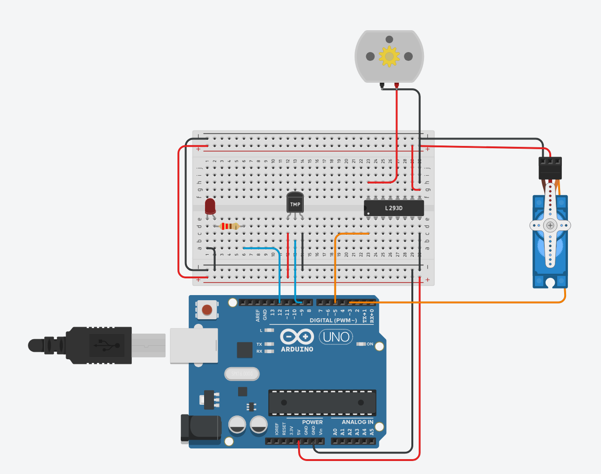
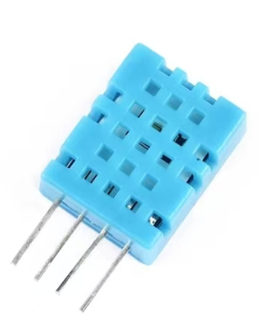

<h1 align="center">HAS: A Simple Home Assistant System</h1>

<i>Like this project? Please consider giving it a Star ⭐️ to help improve!</i>

> This project is an assignment from the "Interactive Technology" course. The task was to design and implement a smart home user interface that can collect temperature and humidity data or control a light. I named it HAS, which stands for "A Simple Home Assistant System." The project primarily uses the Arduino microcontroller to simulate actual smart home control, Flask as the lightweight web framework for building the web server (Life is short, I use Python!), Figma for designing the frontend interface, and HTML/CSS/JavaScript (the "Frontend Trio") + Bootstrap for building the frontend web page. Due to my limited capabilities, some parts of the work were done with the help of ChatGPT. If you notice any errors or areas for improvement, please feel free to offer your suggestions.

### Updates

#### 24.12.7 Update

- Created repository
- Added README.md
- Added circuit design
- Added firmware code

### 1. Project File Description

### 2. Circuit Design

The circuit design initially plans to use the Arduino microcontroller to simulate smart home control for a typical bedroom.

- Use a diode to simulate a ceiling light.
- Use a servo to simulate an electric curtain.
- Use a temperature and humidity sensor to simulate a thermometer.
- Use a DC motor to simulate a fan.
- More to be added...

#### 2.1 Circuit Design Diagram

#### 2.2 Simulation Wiring Diagram

#### 2.3 Physical Wiring Reference

#### 2.4 Microcontroller Selection

Currently, I am using the Arduino Uno3, as Arduino has a large number of pre-packaged third-party libraries, making it easy to get started.

In the future, I plan to replace it with the ESP32, which has Bluetooth and Wi-Fi capabilities, enabling wireless data transmission.

For an Arduino beginner's guide, you can refer to [Tai Chi Maker – Arduino, AI, IoT applications, development, and learning resources](http://www.taichi-maker.com/)

#### 2.5 Temperature and Humidity Sensor Selection

I have selected the DHT11 sensor for the temperature and humidity measurement.

Model: Humidity Sensor DHT11
Operating Voltage: 3-5.5V
Temperature Measurement Range: 0°C ~ 50°C
Temperature Measurement Accuracy: ±2°C
Temperature Resolution: 1°C
Humidity Measurement Range: 20% ~ 90% (0~50°C MAX)
Humidity Measurement Accuracy: ±5%
Humidity Resolution: 1% RH

Pin Definitions:
- Pin 1 (VDD): Power supply 3-5.5VDC
- Pin 2 (DATA): Serial data, single-wire
- Pin 3 (NC): No connection, leave floating
- Pin 4 (GND): Ground, negative power

Dimension Diagram:

Reference Circuit Diagram:

### 3. Software Architecture

#### 3.1 Firmware Code

The firmware code is stored in the [control_and_recieve_data](Software/control_and_recieve_data) directory. You can upload it to the Arduino Uno3 using the Arduino IDE.

### 4. Web Design Description

